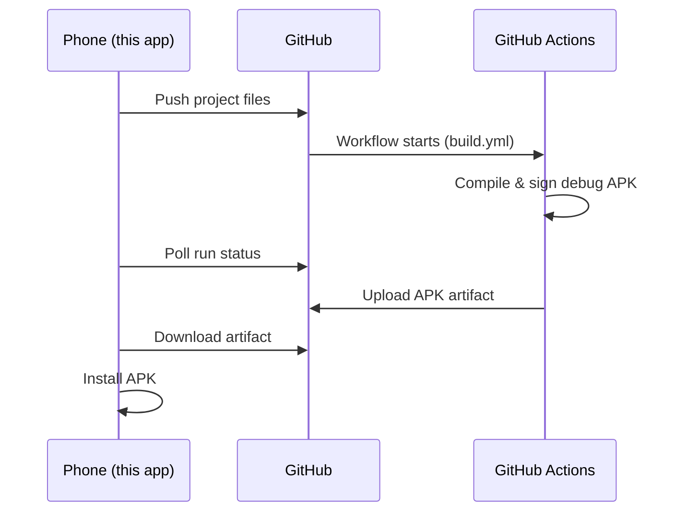
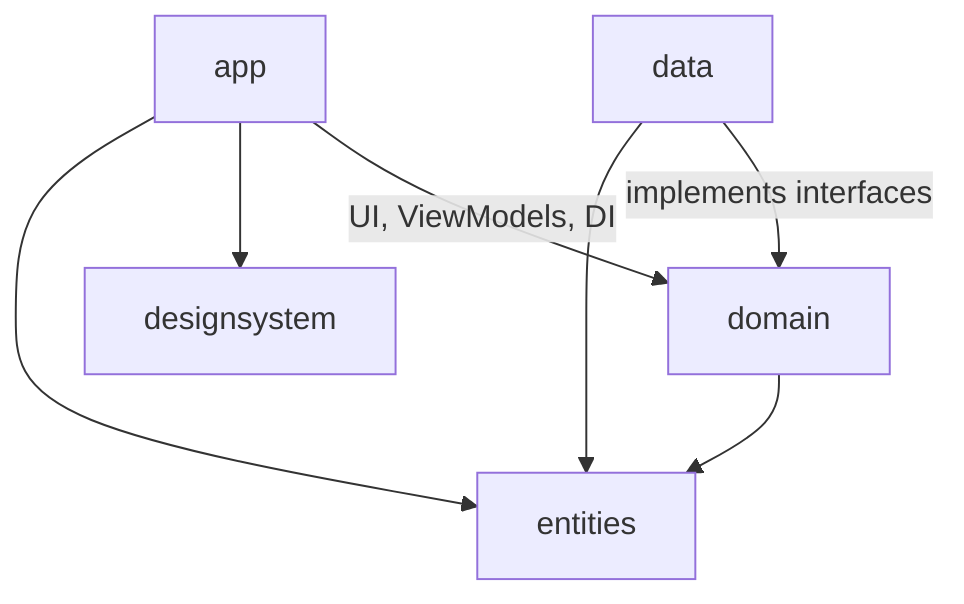

# Android Studio Lite

A lightweight Android IDE that runs **on your phone**. Write Kotlin code, manage Git branches, open pull requests, and build real APKs — all from an Android device, with no computer needed.

The trick: your phone never compiles anything. Every project lives in a GitHub repository, and **GitHub Actions does the heavy lifting** in the cloud. The app pushes your code, waits for the CI build, then downloads the finished APK so you can install it right away.

## Features

- 📁 **Projects** — create new Android projects from a built-in template, or import any of your existing GitHub repositories.
- ✍️ **Code editor** — syntax highlighting, auto-completion, bracket-balance linting, project-wide search, and find & replace.
- ☁️ **Cloud builds** — one tap pushes your code and runs a GitHub Actions workflow that compiles a signed debug APK. If nothing changed, the latest successful build is reused instead of rebuilding.
- 🌿 **Version control** — commit history, diffs, branching, branch comparison, and pull requests (create, review, merge) straight from the app.
- 🔐 **GitHub account** — sign in with a personal access token, stored encrypted on the device.

## How a build works



Every generated project ships with two important files:

- `.github/workflows/build.yml` — the CI workflow that builds the APK on every push.
- `app/debug.keystore` — a fixed signing keystore committed to the repo, so every build is signed with the **same key**. Without it, each CI run would sign with a new random key and Android would refuse to update the installed app.

## Architecture

The project is split into five Gradle modules with a strict dependency direction — everything points inward toward `entities`:



| Module | What it contains | Depends on |
|---|---|---|
| `entities` | Plain Kotlin data models (`Project`, `Build`, `Git`, `Search`). No Android, no libraries. | nothing |
| `domain` | Business logic: use cases (`RunBuildUseCase`, `GitUseCases`, `FileUseCases`, …) and repository **interfaces**. Pure Kotlin, fully unit-testable. | `entities` |
| `data` | Repository **implementations**: GitHub REST client (Ktor), local file system, encrypted settings (DataStore), and the project template. | `domain`, `entities` |
| `designsystem` | Reusable Compose UI: theme, colors, fonts, icons, and shared components (buttons, sheets, tabs, chips, …). | nothing app-specific |
| `app` | The screens, ViewModels, navigation, and dependency injection wiring (Koin). | all of the above |

The key rule: **`domain` defines interfaces, `data` implements them.** The business logic never knows it's talking to GitHub or to disk — which keeps it simple to read and easy to test.

### Screen pattern (MVI)

Every screen in `app/.../feature/` follows the same five-file structure, so once you've read one feature you can read them all:

```
feature/build/
├── BuildScreen.kt               # Compose UI — draws the state, nothing else
├── BuildScreenState.kt          # One immutable data class = everything on screen
├── BuildScreenEffect.kt        # One-shot events (navigate, show toast, …)
├── BuildInteractionListener.kt # Interface of every action the user can take
└── BuildViewModel.kt           # Handles actions, updates state, emits effects
```

The flow is a single loop:

```
User taps → InteractionListener → ViewModel → new ScreenState → UI redraws
                                       └────→ ScreenEffect → navigation / toast
```

Features: `onboarding`, `projects`, `editor`, `build`, `vcs`, `settings/github`. Shared plumbing lives in `feature/base/` (`BaseViewModel`, effect handling) and cross-screen state in `session/`.

## Tech stack

- **Kotlin** + **Jetpack Compose** (Material 3) — UI
- **Navigation 3** — navigation
- **Koin** — dependency injection
- **Ktor** (OkHttp engine) — GitHub REST API client
- **DataStore + Security Crypto** — encrypted token storage
- **Coroutines / Flow** — async work and state
- `minSdk 26`, `targetSdk 36`

## Getting started

1. Clone the repo and open it in Android Studio.
2. Run the `app` configuration on a device or emulator (Android 8.0+).
3. In the app, go through onboarding and paste a GitHub **personal access token** with `repo` and `workflow` scopes.
4. Create a project, edit some code, and hit **Build** — the APK arrives from GitHub Actions in a few minutes.

## Running tests

Unit tests live next to the code they test in the `domain` module:

```bash
./gradlew :domain:test
```
